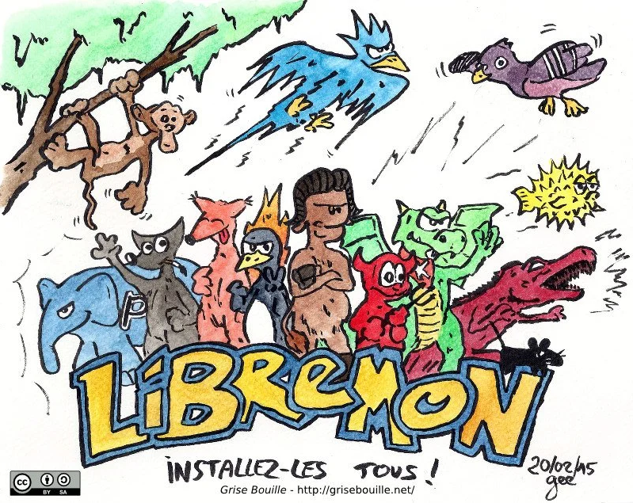
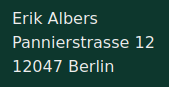

# About Open Source Gardens

Open Source Gardens connects people via Open Source (philosophy, seeds, software & hardware) in a horticultural and creative way. Read about who we are and why we are doing this on this page.

Table of content:

- [What is Open Source?](#what-is-open-source)
- [What are Open Source Seeds?](#what-are-open-source-seeds)
- [Why Open Source Gardens?](#why-open-source-gardens)
- [Who is behind Open Source Gardens?](#who-is-behind-open-source-gardens)

## What is Open Source?

"Open Source" was a term created in the 90's to refer to software that was until-then called "Free Software". Nowadays, both refer to the same idea of software, that is software which is realeased under the terms that allows every human to do whatever they want with the software. You can share it, you can sell it, you modify it, you can delete it and more. These rights are ensured with the help of a special legal form, a "license".

This new form of software, the idea of software as a collective good found world-wide followers quickly. Soon they have created their own ecosystem of software. Until today this ecosystem keeps constantly growing and even became the standard in many sectors of modern software production. The community was very successful to make its own believes known to the masses and adopted as standard. The associated communities have often chosen an animal as a mascot.

A prominent example of an Open Source project is the Wikipedia: Anyone can edit it, can read it, can modify it, download it, share it and basically do whatever they want with the knowledge inside. And so we refer to the [Wikipedia article][1] for further reading and understanding of the concept of Open Source.

## What are Open Source Seeds?

In the 2000s, when Open Source has gained more and more friends, we see how in turn related movements have emerged. Although they are dedicated to other fields of activity, they are committed to the same idea. Common to any other open source movement is the idea to not privatize knowledge and power but rather releasing it into the community and the commons. Which is why they all use similar terms of _"Open"_: _"Open Source Hardware"_, _"Open Knowledge"_, _"Open Access"_, _"Open Education"_, _"Open Data"_ and many, many more and since 2012 also _"Open Source Seeds"_.

Common to all these communities is the desire to open up existing knowledge, associated processes and related power structures and make them potentially globally accessible to all people - regardless of background - in the form of the commons. The desire of the open source seed community is thus to regain our seeds as a common for everyone and to protect them legally from patents and other forms of privatization.

## Why Open Source Gardens?

By 2020, 60% of the world wide seeds are already owned by only three chemical corporations DuPont-Dow, ChemChina-Syngenta and Bayer-Monsanto([\*][2]). These three corporations thus control perhaps the most important market and technology since the settlement of the first humans: Farming and breeding. In such an unrivaled "oligopoly" these three corporations can impose further restrictions on our seeds, make entire varieties inaccessible or even ban them completely.

To balance power structures and to preserve the knowledge and processes around regional breeding and adaptation, some breeders have joined forces to communitize their own breeding in the future as "commons". They want to prevent that one day a chemical company can decide which plants and breedings may be allowed in their own garden, which might cost planting fees and which might not be allowed at all.

The use and publication of open source seeds directly helps preservation of biodiversity and the independence of farmers and local agriculture.



### Seeds as commons

Seeds should remain common property! Large and small farmers need the freedom to select and breed their own seeds and to adapt their plants to local conditions and underlying changes. Only the preservation of biodiversity and its adaptability can help us to face the dangers of climate change. We as open source gardeners want to cultivate open source seeds - in our own gardens and in community gardens. We want to grow organically and form a community, a movement. And we want to make our cause known to the masses. For our seeds, our food, biodiversity and climate. For our future.

## Who is behind Open Source Gardens?

We are an initiative, a community, a movement ... an idea floating around in our heads and within our network. There is no official legal body or organisation. This page is run by the person mentioned in the imprint and the movement is set up by many countless individuals.

### Imprint

[1]: https://en.wikipedia.org/wiki/Open_source
[2]: https://www.boell.de/de/aus-sieben-werden-vier-der-markt-fuer-kommerzielles-saatgut
