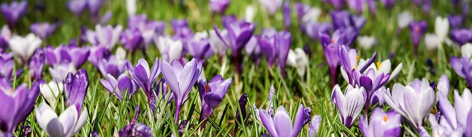

# Open Source Seeds

Open Source Seeds are seeds that everyone can use for any purpose. On this page you can learn about how to get seeds and ways to share them.

Table of content:



## Ordering seeds

Normally you order open source seeds directly from their breeders or more and more from third-party re-sellers. To help you find seeds, sellers and breeders, there is a service provider called "Open Source Seeds", which acts as an interface to connect breeders and growers. To this end Open Source Seeds maintains a [list of officially licensed open source licensed seeds][openSourceSeeds-dieListe] and their respective suppliers. You can browse the catalogue online and once you have decided on your seed selection, you can order directly from the respective breeder(s).

The US "Open Source Seeds Initiative" also [maintains a list of available open source seeds and their distributors][osseeds-distributors] as well as the Latin-American [open source seeds community "Bioleft"][bioleft]. However, due to the European "[Plant Health Law Regulation (EU) 2016/2031][planethealth-eu]" these organisations are not allowed to send these seeds to Europe.

## Spring campaign: [#ConnectingGardens][connecting-gardens]

In our spring campaign "Connecting Gardens" we want to help you start growing Open Source Gardens and connect you via gardens and beyond borders. If you like to participate, we send you one of our "starter kits" including multiple varieties of Open Source Seeds. But in the end, not matter from where you receive your Open Source Seeds: you are welcome to join #ConnnectingGardens, as long as it is open source.

Read more about our spring campaign on [our connecting gardens page][connecting-gardens].



## Seed saving and sharing

Actually, saving seeds from the fruits of your current harvest for your plants in the next season is a thousands of years old key practice to grow plants and cultivate new breedings. Still, many of us do not know how to save seeds and to help you along, we decided to offer an interactive online workshop presented by [Aimee Fenech][aimee]. This is a recording of our session:



Love goes out to Aimee for holding the session, to Björn for preparing the video and to the Center for the Cultivation of Technology for hosting us and letting us record the session.

### Seed sharing

We encourage decentral seed sharing among yourselves. While we have plans to offer an infrastructure for it, until then we boost any offer or search of old seeds or open source seeds that people ping our [Mastodon handle][mastodon] with or that they mark with the hashtag #OpenSourceGardens, #ConnectingGardens or #OpenSourceSeeds.

[openSourceSeeds-dieListe]: https://www.opensourceseeds.org/en/die-liste
[osseeds-distributors]: https://osseeds.org/seeds/
[bioleft]: https://www.bioleft.org/plataforma/
[planethealth-eu]: http://eur-lex.europa.eu/legal-content/EN/TXT/?uri=CELEX:32016R2031
[connecting-gardens]: /connecting-gardens
[aimee]: https://aimeefenech.com/
[mastodon]: https://chaos.social/@opensourcegardens
