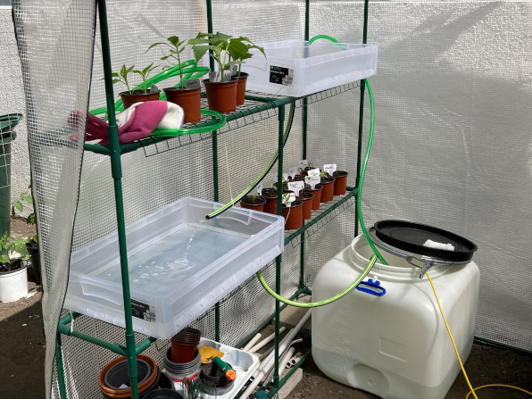

# Technologies

Not only planting Open Source Seeds but also using Open Source Technologies for your garden is a more sustainable approach and overlaps with permaculture design princples. Also you feed the commons.

On this page you find several handpicked recommendations for Open Source Software solutions for your garden. This is by far an exhaustive list neither do we have such but we like to offer an interactive collection about technical open source solutions for your garden on a future wiki page. Until then we maintain a short list below to help you right now and to make you curious to discover more:

## Software

### garden-party.io

> [Garden Party](https://garden-party.io/) is an Open Source application designed to help budding gardeners managing their garden. You can organise your garden, take notes about your plants and save pictures. It also comes wit a social component where you can for example share tasks etc.

### Powerplant

> [powerplant](https://wiki.ecohackerfarm.org/powerplant:start) is an open source software that allows anyone planning a garden to utilize companion planting and other permaculture practices. It provides intelligent suggestions to help the gardener by advising the best planting schedules and combinations of crops to maximize the garden's yield.

### iNaturalist

> [iNaturalist](https://www.inaturalist.org/) helps you to identify the plants and animals around you using your mobile phone. Get connected with a community of over a million scientists and naturalists who can help you learn more about nature!

### Forest Sounds

> [Forest sounds](https://timberfestival.org.uk/soundsoftheforest-soundmap/) is a collection of the sounds of woodlands and forests from all around the world, creating a growing soundmap bringing together aural tones and textures from the world’s woodlands. The sounds form an open source library, to be used by anyone to listen to and create from. We would love to see somthing similar for Open Source Gardens around the world.

### Open Olitor

> [OpenOlitor](https://openolitor.org/homepage/) is a web-based, multilingual platform facilitating the setup of a community supported agriculture (CSA) platform, linking producers and consumers.

### farmOS

> [farmOS](https://farmos.org/) is a web-based application for farm management, planning, and record keeping. It is developed by a community of farmers, developers, researchers, and organizations with the aim of providing a standard platform for agricultural data collection and management.

### Hugo

> [Hugo](https://gohugo.io/) is an static website builder. It is developed by a community of developers. Sourcecode can be found on [Github](https://github.com/gohugoio/hugo).

### More to come ...
